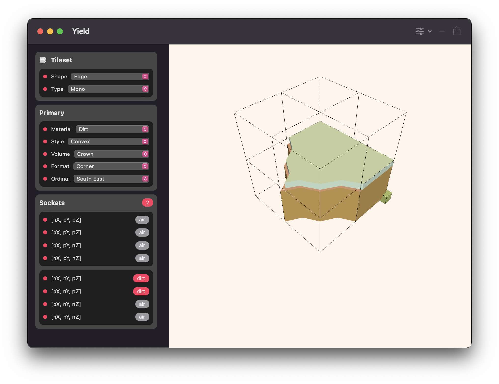
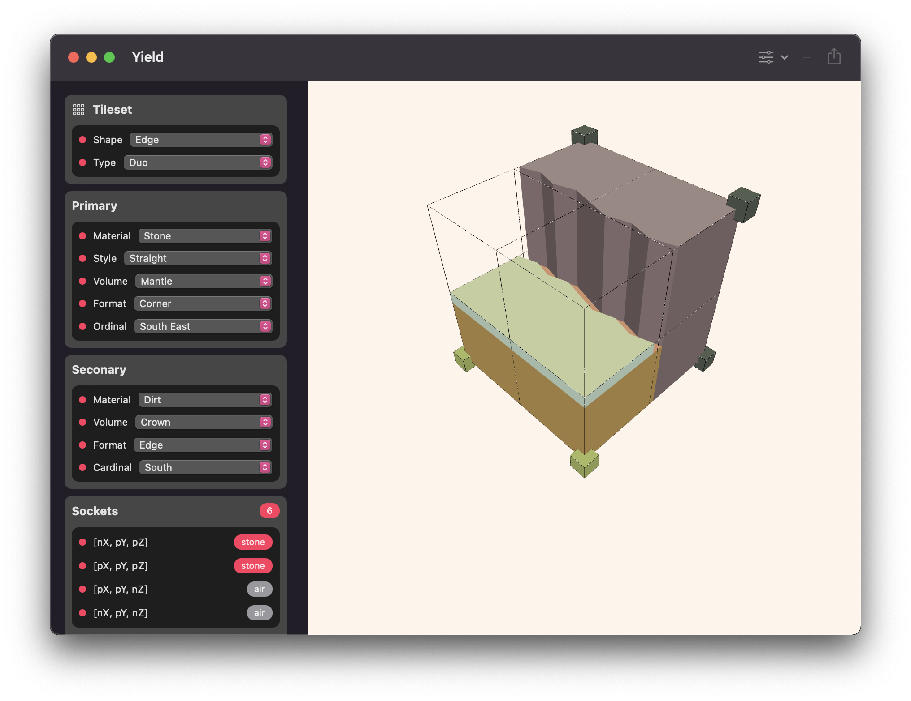
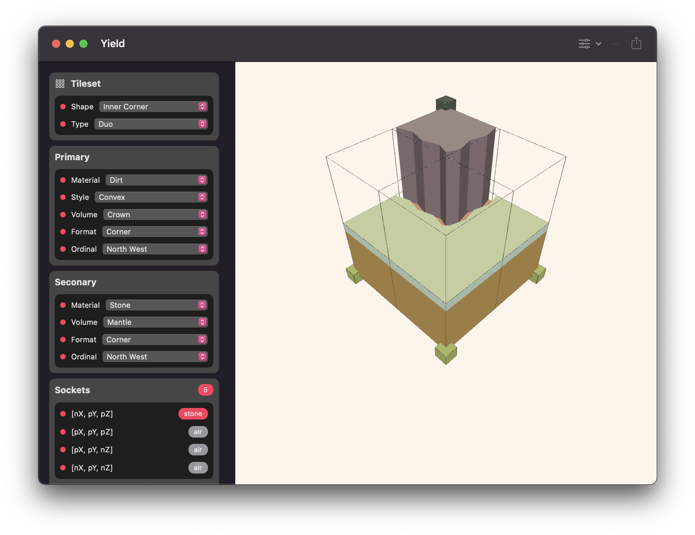
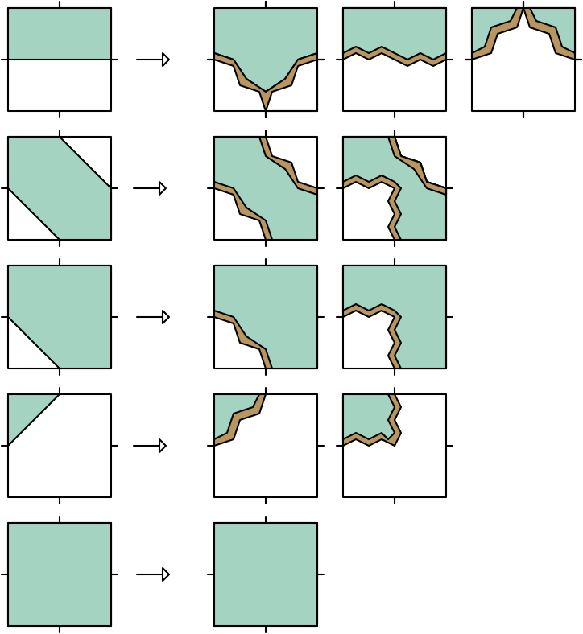
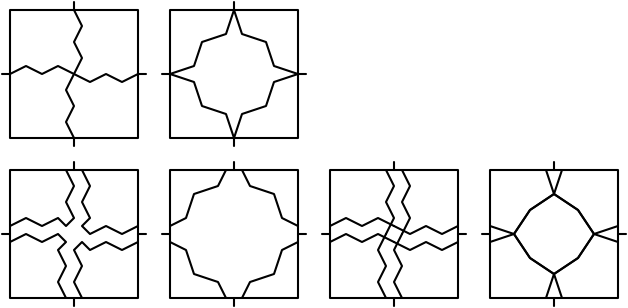
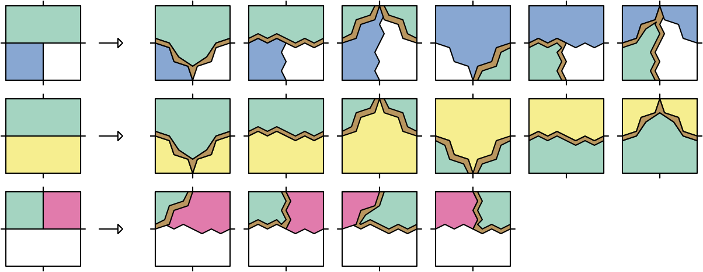
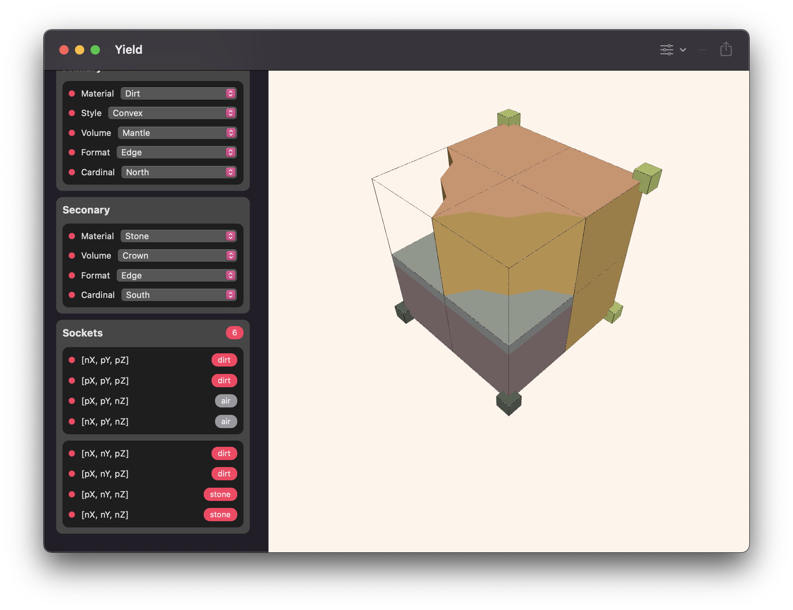

# Introduction
Yield is a macOS application written with SwiftUI to facilitate the visualisation and generation of terrain tilesets for use in [Wave Function Collapse](https://en.wikipedia.org/wiki/Wave_function_collapse) and [Marching Cube](https://en.wikipedia.org/wiki/Marching_cubes) based terrain generation systems. Primarily built for usage with [Harvest](https://github.com/zilmarinen/Harvest) and [Meadow](https://github.com/zilmarinen/Meadow), Yield compiles a known set of tile configurations from a handful of surface materials that can be used as a tileset for terrain generation.

# About
Yield was built as a prototyping tool to allow for rapid development and visual feedback of terrain tilesets that are generated programmatically. Considering the volume of tile variations and the amount of time it would take to create a complete set by hand, building a tool that can easily generate both the model and any appropriate socket/rotation information is a more sustainable strategy.

# Inspiration
Heavily inspired by [Oskar Stålberg](https://oskarstalberg.tumblr.com)'s work on WFC systems for [Townscaper](https://www.townscapergame.com) and [Bad North](https://twitter.com/BadNorthGame), the aim of this project is to generate complex geometric shapes that tesselate correctly on a 3D grid system without the use of any third party modelling tools.

# Meshes

Before delving into 3D, a set of shapes are first outlined in 2D to describe the tesselations between tiles along each edge for any given rotation. Only five unique tiles are needed here to describe a complete set. Variations are then added for concave and convex shapes to provide contrasting styles for each material and tile configuration.

The outlines for each corner and edge are then extruded into 3D biscuit cutters that can be used within [CSG](https://en.wikipedia.org/wiki/Constructive_solid_geometry) operations to create complex shapes. Each layer of the materials within a tile are built up by intersections, subtractions and unions of a surface and the appropriate biscuits for the tiles socket configuration.

Combining the results of the CSG operations on different materials allows for multiple styles within a single tile which vastly increases the diversity of the resulting tileset. Each material describes their appearance and adjacency information to provide variations where two differing materials meet resulting in seamless transitions between material types along each edge and also between tiles.

# Sockets

To define the adjacency rules of each tile configuration, sockets are placed upon each corner of a uniform cube to define the material type. A tile has both upper and lower sockets which can be visualised as the colored cubes at each corner where a material other than `air` exists. Socket information is stored alongside the mesh and can be used to validate the placement of a tile by checking that the intersecting corners of tiles surrounding each corner/edge have a matching material.

## Dependencies
[Euclid](https://github.com/nicklockwood/Euclid) is a Swift library for creating and manipulating 3D geometry and is used extensively within this project for mesh generation and vector operations.

[PeakOperation](https://github.com/3Squared/PeakOperation) is a Swift microframework providing enhancement and conveniences to [`Operation`](https://developer.apple.com/documentation/foundation/operation). 

